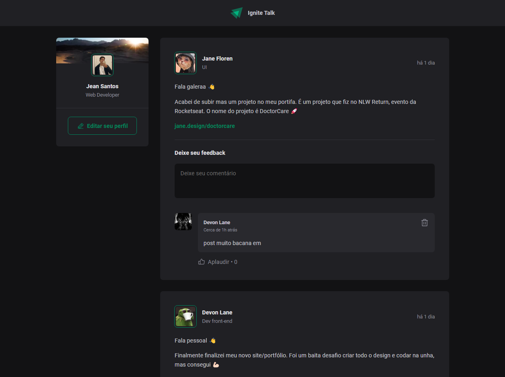

<h1 align="center">IgniteTalking</h1>

project carried out together with Diego Fernandes in the introduction to Reactjs course at ignite

    <a href="#-tecnologias">Technologies</a>&nbsp;&nbsp;&nbsp;|&nbsp;&nbsp;&nbsp;
    <a href="#-Projeto">Projects</a>&nbsp;&nbsp;&nbsp;|&nbsp;&nbsp;&nbsp;
    <a href="#-Libraries">licenses</a>

  

  

 

## 🚀 Tecnologias

This project was developed with the following technologies:
- Vite;
- ReactJS;
- TypeScript
- JavaScript

## 💻 Projects

application developed entirely on the front, representing a chat site

## licenses

MIT.